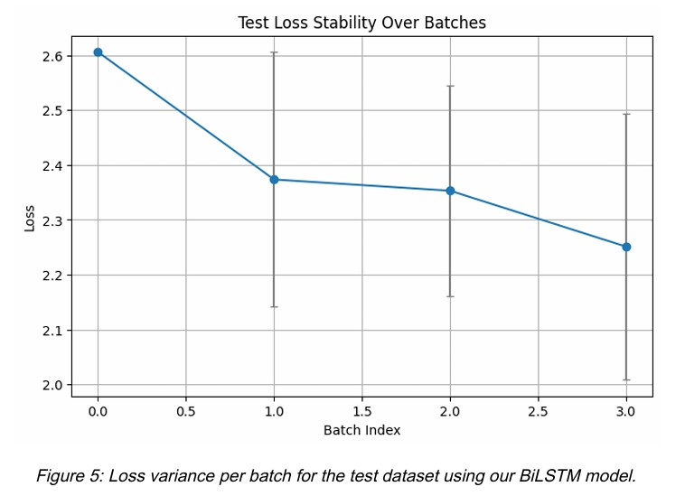
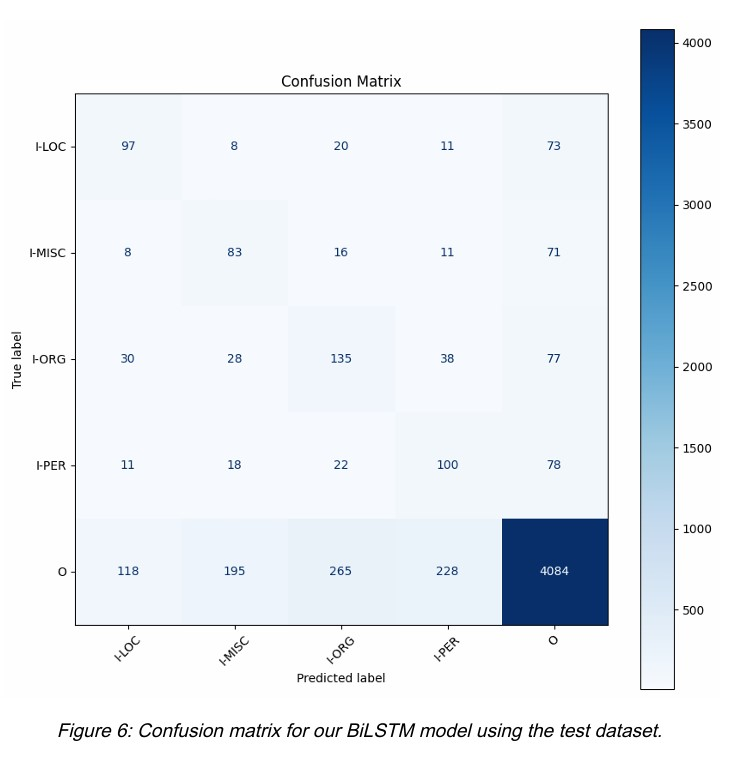
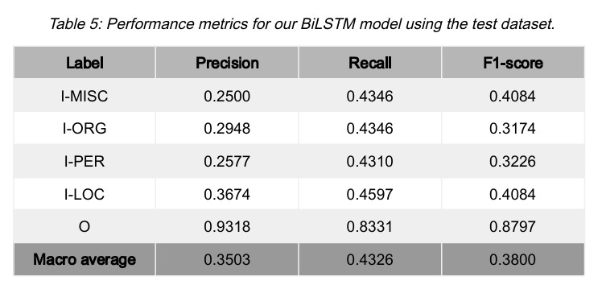
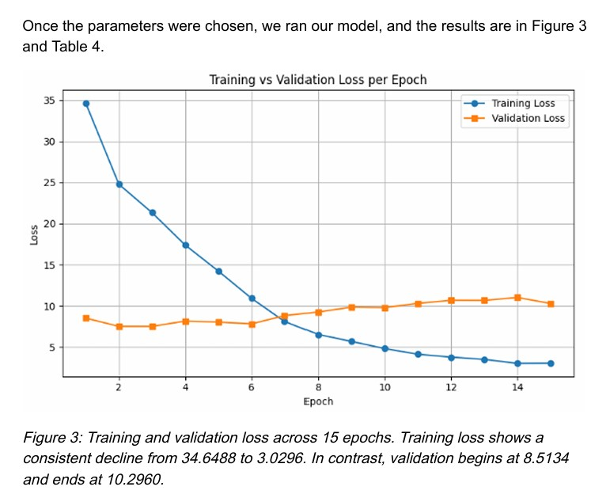
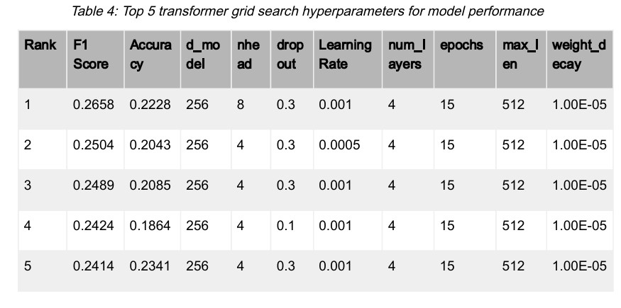
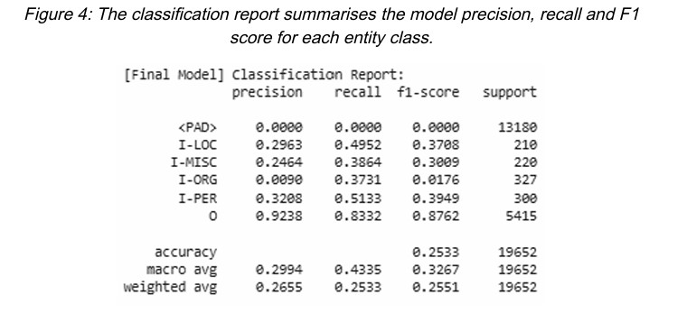

# 🧠 Named Entity Recognition (NER) with BiLSTM and Transformer Models

This project implements a deep learning solution for the **Named Entity Recognition (NER)** task using both a **BiLSTM** and a **custom Transformer** model. The goal is to classify each word in a sentence into predefined entity types, enabling structured extraction of information from text.

---

## 📚 Project Overview

Named Entity Recognition is a core task in **Natural Language Processing (NLP)** used in:

- Information Retrieval
- Question Answering
- Text Summarization

In this project, each word is tagged with one of the following entity types:

| Label     | Meaning             |
|-----------|---------------------|
| `I-LOC`   | Location             |
| `I-PER`   | Person               |
| `I-ORG`   | Organization         |
| `I-MISC`  | Miscellaneous        |
| `O`       | Outside (non-entity) |

> ⚠️ **Note**: The dataset used in this project was provided by the University of Liverpool for academic use only and is not included in this repository. It follows the CoNLL-2003 NER format with custom-labeled content.

---

## 🧠 Task Details

- 🔡 **Dataset**: 1696 sentences (custom dataset)
- 🧾 **Format**: `word` + `entity` (space-separated), sentences separated by blank lines
- 🎯 **Goal**: Predict the correct entity for each token using deep learning models

---

## 🧰 Approach

- **Models**: BiLSTM and custom Transformer architectures
- **Loss Function**: Categorical Cross Entropy
- **Preprocessing**: 
  - Tokenization
  - Padding & masking
  - Label encoding
- **Evaluation Metrics**: 
  - Accuracy
  - Precision / Recall / F1 Score (macro and weighted)
  - Confusion Matrix
  - Loss over epochs/batches

---

## 🔍 Model Comparison Summary

Based on evaluation, the **BiLSTM model outperformed** the custom Transformer, showing better generalization and entity recognition across classes.

| Model        | Macro F1 Score | Weighted F1 | Accuracy | Notes                             |
|--------------|----------------|-------------|----------|-----------------------------------|
| **BiLSTM**   | **0.3800**     | 0.8797      | ~0.43    | Strong generalization & stability |
| Transformer  | 0.3267         | 0.2551      | 0.2533   | Overfitting observed              |

---

## 📊 BiLSTM Evaluation

### 📉 Test Loss per Batch

<p align="center">
  
</p>

*Loss variance per batch for the test dataset using the BiLSTM model.*

---

### 🧩 Confusion Matrix

<p align="center">
  
</p>

*Confusion matrix showing predicted vs true entity labels.*

---

### 📋 Classification Report

<p align="center">
  
</p>

*Precision, recall, and F1-score for each entity label from the BiLSTM model.*

---

## 🔬 Transformer Evaluation

### 📈 Training vs Validation Loss

<p align="center">
  
</p>

*Training and validation loss across 15 epochs. Overfitting was observed after epoch 6.*

---

### 🧪 Hyperparameter Grid Search

<p align="center">
  
</p>

*Top 5 hyperparameter combinations for the Transformer model ranked by F1 Score and Accuracy.*

---

### 📋 Classification Report

<p align="center">
  
</p>

*Final classification report showing the Transformer model’s precision, recall, and F1 scores.*

---

## 🗂️ Project Structure

```
ner-entity-recognition/
├── ner_model.ipynb # Main notebook with both models and evaluations
├── ner_dataset.txt # ⚠️ Not included due to academic restrictions
├── plots/
│ ├── BiLSTM_Loss_variance_per_batch.jpg
│ ├── BiLSTM_CF.jpg
│ ├── BiLSTM_Performance_Metrics.jpg
│ ├── Transformer_training_loss_per_epoch_validation_set.jpg
│ ├── Transformer_gridserach_hyperparameters.jpg
│ └── Transformer_classifcation_report.jpg
├── LICENSE # Custom academic license
└── README.md # Project documentation

```
--- 

## ⚠️ License

This project was completed as part of an academic assignment.

You may **not** copy, reuse, or distribute any part of this repository without explicit permission.

See the [LICENSE](LICENSE) file for full details.

© Devarshi Choudhury, University of Liverpool, 2025. All rights reserved.
